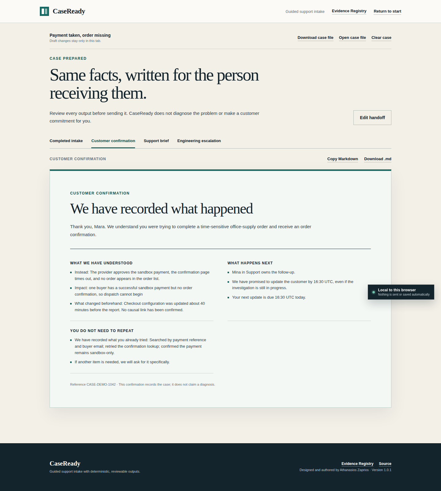
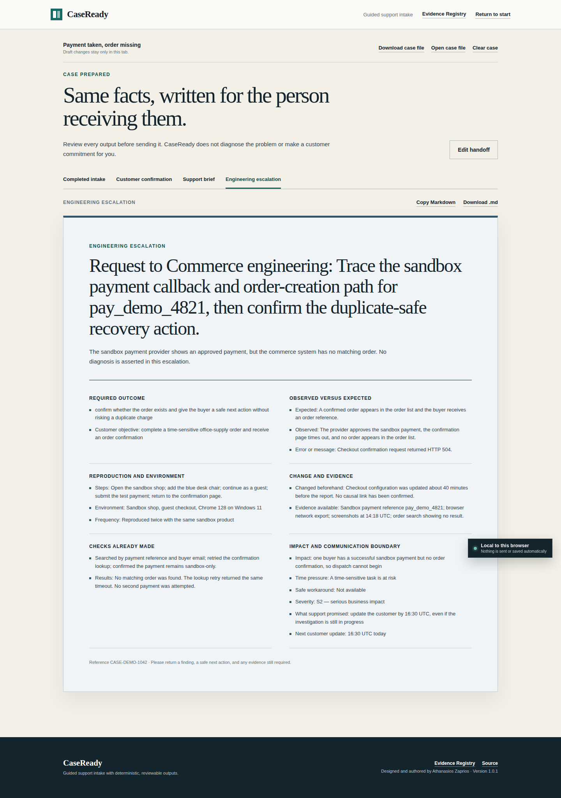

<p align="center">
  
</p>

CaseReady guides a support conversation and turns the verified facts into a customer confirmation, an internal brief and a precise engineering escalation.

[**Live application: zpthanos.github.io/CaseReady/**](https://zpthanos.github.io/CaseReady/)

[](https://zpthanos.github.io/CaseReady/)
[](https://github.com/zpthanos/CaseReady/actions/workflows/ci.yml)
[](./LICENSE)

## Try this scenario

Open **Payment taken, order missing** on the home screen. Move through the five stages, review the suggested severity, then generate the case outputs. The scenario is fictional and every answer remains editable.

<p align="center">
  
  
</p>
<p align="center"><sub>Customer confirmation and engineering escalation generated from the same fictional intake.</sub></p>

## Why I built this

In my customer-facing work, I have seen technical investigations slow down for reasons that are not deeply technical. The customer’s actual objective is missing, business impact is unclear and evidence is collected after the first handoff. The customer then repeats the same context while internal teams receive either too little information or an unfiltered ticket transcript. Technical updates can also reach the customer without explaining what happens next.

I built CaseReady to demonstrate a better interaction: one guided conversation that records the facts once and produces different, useful outputs for the customer, support team and technical resolver.

## What the product does

- Begins with what the customer was trying to complete, then records impact and urgency.
- Asks what changed, what has already been tried, the environment and the available evidence.
- Records ownership, the next update and what has been promised to the customer.
- Suggests an editable severity from explicit impact-and-urgency rules.
- Generates deterministic customer, support and engineering outputs without inventing a diagnosis or commitment.
- Copies or downloads each output as Markdown and saves a case file only when the operator asks.

Three fictional scenarios are included for inspection. The completed Markdown exports in [`examples/`](./examples) are generated by the same application logic.

The images in [`docs/screenshots/`](./docs/screenshots) are captures of the deployed application, including the blank intake, validation, sensitive-data warning, completed intake, each output type and the mobile layout.

## Privacy model

CaseReady has no backend, account system, analytics integration or automatic draft persistence. Answers stay in the active browser tab. Refreshing or closing the tab discards an unsaved case; **Download case file** is the explicit local-save action.

A focused warning looks for credential-like text, private keys and full payment-card numbers in the evidence field. This is a guardrail, not a guarantee. Operators should still remove customer records, authentication material and unnecessary personal information before entering a case.

The full model and its boundary are documented in [`docs/PRIVACY.md`](./docs/PRIVACY.md).

## Design decisions

The product deliberately has no backend or generative-AI layer. Customer and internal outputs are separate, drafts are not persisted automatically, severity remains editable, and the conversation begins with the customer’s objective. The trade-offs behind each choice are recorded in [`docs/DECISIONS.md`](./docs/DECISIONS.md).

## Local installation

CaseReady requires Node.js 22.13 or later.

```bash
git clone https://github.com/zpthanos/CaseReady.git
cd CaseReady
npm ci
npm run dev
```

The development server prints the local address. No environment variables or external services are required.

## Tests

```bash
npm run lint
npm test
```

The test suite checks the severity rules and deterministic outputs, confirms that committed examples match the generator, scans published copy for unfinished markers, builds the static production application and verifies its deployment metadata and asset paths.

## Honest limitations

- A case does not follow an operator between devices, and there is no shared queue or collaborative editing.
- CaseReady does not connect to ticketing systems, monitoring services or customer databases.
- The severity rules are a starting point; the operator must apply the organisation’s incident policy.
- Sensitive-data detection is intentionally narrow and cannot replace a careful review.
- The generated writing reflects the information entered. It cannot diagnose a fault or repair missing context.
- Local downloads are unencrypted files under the operator’s control.

## Relationship to the Evidence Registry and Production Stories

CaseReady applies the same working habits documented in my [Evidence Registry](https://zpthanos.github.io/zpthanos/) and [Production Stories](https://github.com/zpthanos/production-stories): clarify the objective, preserve evidence, make ownership visible and give the next team a specific request.

It is a separate, runnable product rather than a replacement for either collection. The registry organises evidence of completed work; the stories explain the decisions and communication around that work; CaseReady demonstrates those habits in one support interaction.
